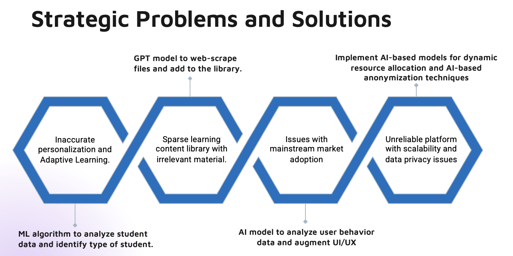
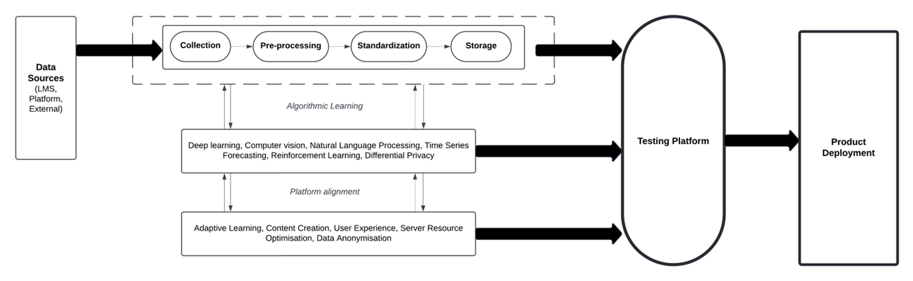

# AI-driven Technology Strategy for an Learning Management SaaS startup

As part of my graduate course *MGT 5804*, I developed a comprehensive AI-powered technology strategy for **Cleverest.ai**, an innovative SaaS platform integrating with LMS systems to provide data-driven personalized learning experiences.

  

## Key highlights:

### 1. Addressed critical challenges in personalization, content relevance, market adoption, and platform reliability.

  

### 2. Proposed AI-driven solutions including:
 - ML algorithms for student data analysis and adaptive learning
 - GPT models for content generation and curation
 - AI-based UX enhancement and resource allocation
 - Advanced data privacy techniques

### 3. Developed a customer segmentation strategy targeting early adopters in the education sector.

  

### 4. Structured a robust data pipeline and AI strategy leveraging various algorithms:
 - Deep Learning for user clustering
 - Computer Vision for content curation
 - NLP for personalized material generation
 - Time Series Forecasting for resource allocation
 - Reinforcement Learning for adaptive learning paths
 - Differential Privacy for data protection

  

### 5. Outlined a value network and ecosystem strategy, emphasizing seamless LMS integration and a tier-based freemium model.

  

  

